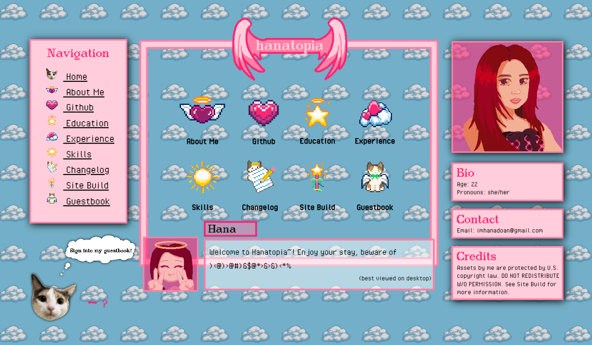

<h1 align="center">Hanatopia</h1>
<h3 align="center">🌐 Live Site</h3>
<h3 align="center">Personal Portfolio Website v1.0.0 </h3>
<h4 align="center">Started Feb 2026 - Completed June 2026</h4>

##  Table of Contents
- [About Project](#-about)
- [Copyright](#-copyright)
- [Assets](#-assets)
  - [Fonts](#fonts)
  - [Images](#images)
- [Credits](#-credits)

##  About 

This is a personal portfolio project that showcased all of my skills, experience, and other relevant personal information.
- Contains updated information from my resume including completed, in-progress, and planned projects.
- Implements a fully customized UI layout inspired by early 2000's pixel games and dating simulators.
- Intended to be viewed on desktop, but made compatible for most mobile devices.
- Implemented using HTML, CSS, and Javascript through [VS Code](https://code.visualstudio.com/).
- Hosted through GitHub Pages.
- Maintained locally by me through Git :)

##  Copyright

***DO NOT REDISTRIBUTE MY ART!***
- All images and artwork belong to me and I do not consent for public or commerical use.
- No licensing is being provided for this project.

##  Assets

### Fonts
- [Dico](https://www.dafont.com/dico.font) by Yannic Kötter
- [ModernDOS 8x14](https://www.dafont.com/modern-dos.font) by Jayvee Enaguas
- [Pixel Operator](https://www.dafont.com/pixel-operator.font) by Jayvee Enaguas

### Images
All illustrations were done through [Aseprite](https://www.aseprite.org/) by me.

##  Credits
Hana Doan

